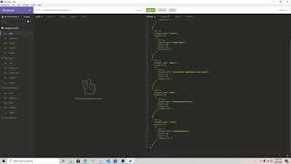

# [E-Commerce Backend](http://www.github.com/SmithBWare89/e-commerce-backend)

## Description
This project is a demonstration of Object Relational Mapping (ORM) by using Sequelize to translate API endpoint requests from an Express server to perform CRUD operations on a MySQL database.

## User Story
```
AS A manager at an internet retail company
I WANT a back end for my e-commerce website that uses the latest technologies
SO THAT my company can compete with other e-commerce companies
```

## Acceptance Criteria
```
GIVEN a functional Express.js API
WHEN I add my database name, MySQL username, and MySQL password to an environment variable file
THEN I am able to connect to a database using Sequelize
WHEN I enter schema and seed commands
THEN a development database is created and is seeded with test data
WHEN I enter the command to invoke the application
THEN my server is started and the Sequelize models are synced to the MySQL database
WHEN I open API GET routes in Insomnia Core for categories, products, or tags
THEN the data for each of these routes is displayed in a formatted JSON
WHEN I test API POST, PUT, and DELETE routes in Insomnia Core
THEN I am able to successfully create, update, and delete data in my database
```

## Table of Contents
* [Installation](#installation)
* [Usage](#usage)
* [License](#license)
* [Languages](#languages)
* [Contributing](#contributing)
* [Collaborator](#collaborators)
* [Tests](#test)
* [Questions](#questions)

## Installation
- Install MySQL Command Line Client and add it to your PATH
- Clone repository to local machine
- Navigate to the cloned repository in your command line window
- Run `npm i` to install all Node packages
- Create a `.env` file in the root directory in your text editor and populate it with the following information:
```
DB_NAME = 'ecommerce_db'
DB_USER = 'Your_SQL_Username'
DB_PW = 'Your_SQL_Password'
```
- Create a MySQL instance from your command line using `mysql -u root -p` then enter in your MySQL password
- Run `source db/schema.sql`
- Start the Express server using `npm run start` in a NEW command line window
- Seed the database using `npm run seed` in a NEW command line window
- Open Insomnia Core and test the API endpoints

## Usage
Please watch the walthrough or look at the installation instructions.

```
If you're running this on a local machine then please use the port your command line window tells your the server is running on in Insomnia Core.
The port can be accessed via localhost:<port-number>/api/<endpoint name(category/product/tag)>
```

#### Walkthrough Video
[](https://youtu.be/6E1aJoTwUKc)

## License
[](https://opensource.org/licenses/MIT)

## Languages


## Contributing
Via a `Pull Request` on the repository.


## Collaborators
- [MySQL2](https://www.npmjs.com/package/mysql2)
- [Express](https://www.npmjs.com/package/express)
- [Nodemon](https://www.npmjs.com/package/nodemon)
- [Sequelieze](https://www.npmjs.com/package/sequelize)
- [Dotenv](https://www.npmjs.com/package/dotenv)

## Test
  API endpoints are tested via `Insomnia Core` in the walkthrough video.
  ```
  Category
  ====
  GET/POST - localhost:<port-number>/api/categories
  PUT/DELETE - localhost:<port-number>/api/categories/<category-id>

  Tags
  ====
  GET/POST - localhost:<port-number>/api/tags
  PUT/DELETE - localhost:<port-number>/api/tags/<tag-id>

  Product
  ====
  GET/POST - localhost:<port-number>/api/products
  PUT/DELTE - localhost:<port-number>/api/products/<product-id>
  ```

## Questions
All questions can be directed to [my email](Smithwrestling89@gmail.com) or [github](https://www.github.com/SmithBWare89).
  